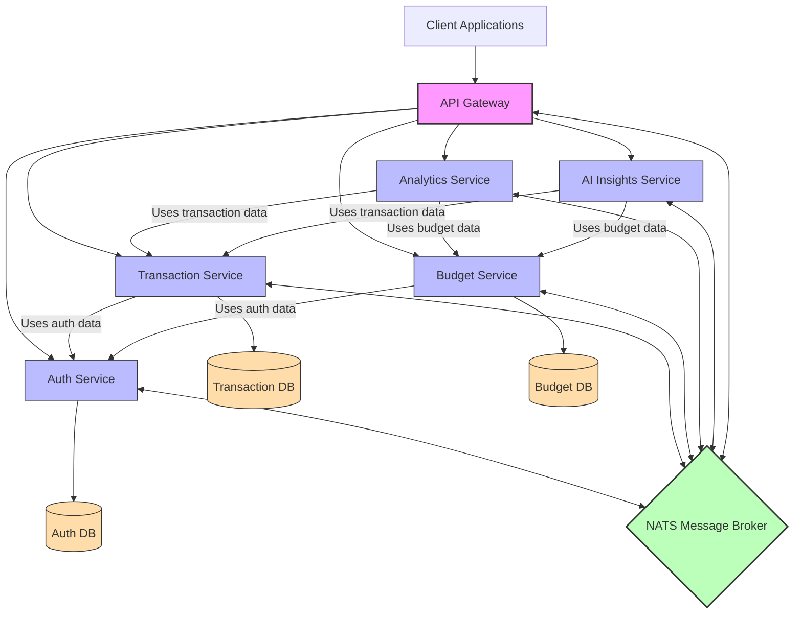

# Money Wise Microservices

A financial management application built with a microservices architecture using NestJS.

## Architecture Overview

This project consists of the following microservices:

- **API Gateway**: Entry point for client applications
- **Auth Service**: Handles user authentication and authorization
- **Transaction Service**: Manages financial transactions
- **Budget Service**: Handles budget creation and tracking
- **Analytics Service**: Provides financial analytics and reporting
- **AI Insights Service**: Offers AI-powered financial insights

All microservices communicate with each other via NATS message broker.

### Architecture Diagram



## Service Descriptions

### API Gateway

- **Purpose**: Single entry point for all client applications
- **Responsibilities**:
  - Route API requests to appropriate microservices
  - Handle authentication and authorization via JWT
  - Provide unified API documentation with Swagger
  - Perform request validation
- **Technologies**: NestJS, Passport.js, Swagger

### Auth Service

- **Purpose**: Manage user authentication and authorization
- **Responsibilities**:
  - User registration and login
  - Password encryption and verification
  - JWT token generation and validation
  - User profile management
- **Technologies**: NestJS, bcrypt, JWT, MongoDB

### Transaction Service

- **Purpose**: Handle financial transaction management
- **Responsibilities**:
  - Create, read, update, and delete transactions
  - Categorize transactions (income, expense)
  - Store transaction metadata (date, category, description)
  - Upload and store transaction receipts
- **Technologies**: NestJS, MongoDB

### Budget Service

- **Purpose**: Manage budget creation and tracking
- **Responsibilities**:
  - Create and manage budget plans
  - Track spending against budget limits
  - Provide budget utilization statistics
  - Support recurring budgets
- **Technologies**: NestJS, MongoDB

### Analytics Service

- **Purpose**: Provide financial analytics and reporting
- **Responsibilities**:
  - Calculate spending patterns
  - Generate financial summaries
  - Provide trend analysis
  - Create visualizable data for dashboards
- **Technologies**: NestJS

### AI Insights Service

- **Purpose**: Provide AI-powered financial insights
- **Responsibilities**:
  - Generate savings recommendations
  - Identify spending patterns
  - Predict future expenses
  - Suggest budget optimizations
- **Technologies**: NestJS, Machine Learning libraries

### NATS Message Broker

- **Purpose**: Enable asynchronous communication between microservices
- **Responsibilities**:
  - Message routing
  - Event broadcasting
  - Service discovery
  - Load balancing

## Prerequisites

<!-- - Docker and Docker Compose -->
- Node.js (v16 or higher) - only for local development
- Yarn or npm - only for local development

## Getting Started

### 1. Clone the repository

```bash
git clone <repository-url>
cd money-wise/microservices
```

<!-- ### 2. Running the Application with Docker

The entire application is designed to run with Docker Compose:

```bash
# Build and start all services
docker-compose up --build

# Run in detached mode
docker-compose up -d

# View logs
docker-compose logs -f

# Stop all services
docker-compose down
```

Docker Compose will:

- Build all service images
- Start the NATS message broker
- Start all microservices with the correct configuration
- Set up the necessary network for inter-service communication -->

## 2. Running the Application with Locally

To run the app locally:

### Install dependencies for each service

```bash
cd api-gateway && yarn install
cd ../auth-service && yarn install
cd ../transaction-service && yarn install
cd ../budget-service && yarn install
cd ../analytics-service && yarn install
cd ../ai-insights-service && yarn install
```

### Mongodb setup

- [Install Mongodb GUI](https://www.mongodb.com/try/download/compass)
- Create appropriate dbs locally ie auth-db, budget-db, transaction-db

### Running services individually

```bash
# API Gateway
cd api-gateway && yarn run start:dev

# Auth Service
cd auth-service && yarn run start:dev

# Transaction Service
cd transaction-service && yarn run start:dev

# Budget Service
cd budget-service && yarn run start:dev

# Analytics Service
cd analytics-service && yarn run start:dev

# AI Insights Service
cd ai-insights-service && yarn run start:dev
```

### Installing and running nat-server

- macOS

```bash
# Install Homebrew if you don't have it
/bin/bash -c "$(curl -fsSL https://raw.githubusercontent.com/Homebrew/install/HEAD/install.sh)"

# Install NATS server
brew install nats-server

# Start NATS server
nats-server
```

- Windows

```bash
# Install Chocolatey if you don't have it
Set-ExecutionPolicy Bypass -Scope Process -Force; [System.Net.ServicePointManager]::SecurityProtocol = [System.Net.ServicePointManager]::SecurityProtocol -bor 3072; iex ((New-Object System.Net.WebClient).DownloadString('https://community.chocolatey.org/install.ps1'))

# Install NATS server
choco install nats-server

# Start NATS server
nats-server
```

- Ubuntu/Debian

```bash
# Download and install the latest release
curl -L https://github.com/nats-io/nats-server/releases/download/v2.10.11/nats-server-v2.10.11-linux-amd64.tar.gz -o nats-server.tar.gz
tar -xzf nats-server.tar.gz
cd nats-server-v2.10.11-linux-amd64
sudo cp nats-server /usr/local/bin

# Start NATS server
nats-server
```

## Service Ports

- API Gateway: 3000
- Auth Service: Uses NATS (no direct HTTP port)
- Transaction Service: Uses NATS (no direct HTTP port)
- Budget Service: Uses NATS (no direct HTTP port)
- Analytics Service: Uses NATS (no direct HTTP port)
- AI Insights Service: Uses NATS (no direct HTTP port)

## API Documentation

The Money Wise API is fully documented using Swagger (OpenAPI). After starting the application, you can access the interactive API documentation at:
http://localhost:3000/api/docs

### Features of the Swagger Documentation
* **Interactive Interface**: Test API endpoints directly from your browser
* **Request/Response Models**: View detailed schema information for all DTOs
* **Authentication Support**: Test secured endpoints with JWT authentication
* **Categorized Endpoints**: Endpoints are grouped by domain (auth, transactions, budgets, etc.)

### Using Swagger with Authentication
1. Use the `/api/docs/auth/login` endpoint to obtain an access token. Copy the user id as well and have it somewhere. 6810a26feda6fc6abc66e32d
2. Click the "Authorize" button at the top of the page
3. Enter your token.
4. All subsequent requests will include your authentication token

## Screenshots

Below are screenshots of the Money Wise application interfaces:


